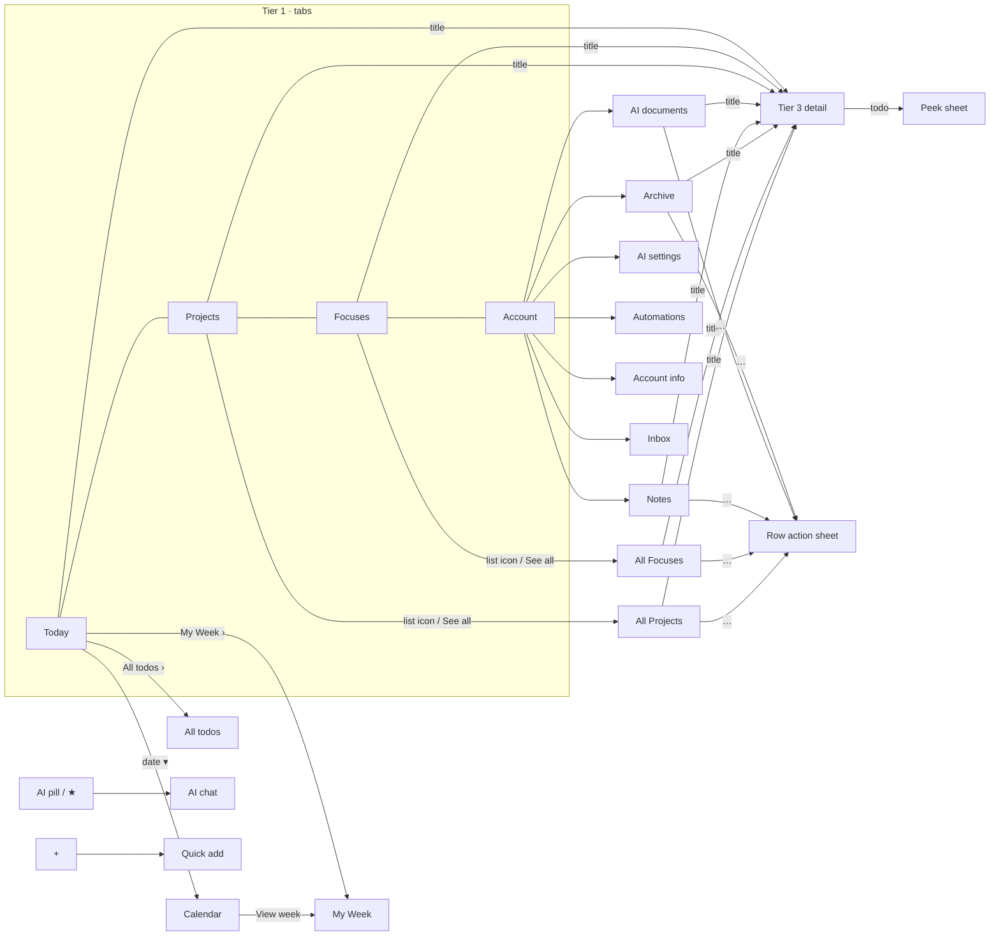

# Life OS — clickable mockup

A clean, coded version of the **Life OS** prototype designed in Claude Design
(`concept/life_management_app_concept.md` → design handoff). It runs in the browser
inside a 402×874 iPhone frame, uses in-memory sample data, and every screen from the
design is wired up and navigable.

```bash
cd mockup
npm install
npm run dev        # http://localhost:5173
npm test           # domain + store unit tests (vitest)
npm run build      # typecheck + production build into dist/
```

## Stack

| Concern | Choice |
| --- | --- |
| UI | React 19 + TypeScript (strict) |
| Build / dev server | Vite |
| State | Zustand: one store, actions next to data |
| Styling | CSS Modules + design tokens as CSS custom properties (`src/styles/global.css`) |
| Tests | Vitest: pure domain rules and store actions |

## Structure

```
src/
  data/seed.ts            sample data + mock clock (Thu Aug 13 2026, 13:45)
  domain/
    types.ts              Project, Focus, Todo, Note, … types
    logic.ts              pure rules: scores, todo buckets, day plan, note feed, calendar math
    selectors.ts          derived views shared by several screens
  store/appStore.ts       app state + every action (navigation, logging, archive, quick add, AI chat)
  components/
    ui.tsx                shared primitives (Card, Ring, Toggle, Sheet, Overlay, tier-2 row card…)
    icons.tsx             the design's inline SVG icons
    device/IOSDevice.tsx  iPhone frame, status bar, dynamic island
    nav/BottomNav.tsx     tab bar + notched AI pill, collapsing mini bar
  screens/
    tier1/                Today (dashboard), Projects, Focuses, Account
    tier2/                All Projects, All Focuses, All todos, Inbox, Account sub-pages
                          (AI settings, AI documents, Automations, Account info, Archive, Notes)
    tier3/                one Detail screen (Project · Focus · Note · AI document),
                          module stack, edit mode, todo peek sheet
    calendar/             My Week (week grid + day timeline), month calendar overlay
    ai/AiChat.tsx         AI chat with scripted replies
  sheets/                 Quick-add sheet, "…" row action sheet
```

## Navigation map



## Where this goes beyond the prototype

These are deliberate. Each one fixes something the prototype only faked or got inconsistent:

- **Actions change real state.** Archive, restore, pause/resume, complete, pin, delete and the
  quick-add forms update the data, not only show a toast. Archived Projects and Focuses open
  their tier-3 page on the tinted background.
- **One log state.** Logging on tier 1, tier 2 and tier 3 writes the same per-trackable key
  (the prototype kept tier 3 in a separate map, so they drifted apart).
- **Counts are derived.** Open todos, "next up" and the Archive count are computed from data
  instead of hard-coded. Two sample todos were added so the pinned project cards show the same
  "next up" items as the design.
- **Coherent calendar.** Week columns show the real dates around the mock "today", and picking a
  day in the month calendar opens the correct week and weekday.
- **Back returns to the list.** Opening a detail from a tier-2 list keeps that list underneath.
- **Collapsing nav fix.** Collapsing the nav at the bottom of a page no longer loops
  (scroll anchoring is off, and bottom-edge clamps are ignored).
- The status bar stays visible above full-screen overlays.
